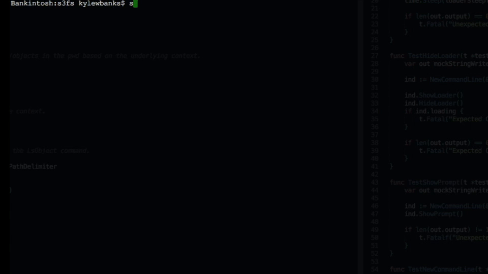

# s3fs

[](https://travis-ci.org/KyleBanks/s3fs) &nbsp; [](https://godoc.org/github.com/KyleBanks/s3fs) &nbsp; [](https://goreportcard.com/report/github.com/KyleBanks/s3fs)

`s3fs` is an [Amazon S3](https://aws.amazon.com/s3/) client that provides a familiar interface for navigating and managing S3 buckets and objects. The goal of `s3fs` is to allow you to interact with Amazon S3 as you would your local filesystem.



# Installation

### Binary 

Simply go to the [releases page](https://github.com/KyleBanks/s3fs/releases) and download the appropriate binary for your environment.

### From Source

`s3fs` is written in [Go](https://golang.org/) and can be installed using `go get` if you have a working Go environment. 

```
go get github.com/KyleBanks/s3fs
```

# Usage 

Execute the `s3fs` command to launch the application, and then use the appropriate commands outlined below to navigate Amazon S3 as if it were a local filesystem.

```
s3fs
```

## cd

Changes the current working directory.

**Examples:**

```
# Move into a bucket
$ cd bucket 

# Move into a folder within a bucket
$ cd bucket/folder/subfolder

# Move back to root
$ cd /
```

## pwd

Prints the current working directory.

**Examples:**

```
$ cd bucket/folder
$ pwd
/bucket/folder
```

## ls

Lists current directory contents.

**Examples:**

```
# Print bucket list when at root.
$ ls
[B] bucket1
[B] bucket2
[B] bucket3

# Print object list when in a bucket.
$ cd bucket1
$ ls
 folder1/
 folder2/
 file1.txt

$ cd folder1
$ ls 
 subfolder/
 file2.txt
 file3.txt
```

## get

Downloads a remote Amazon S3 object to the local filesystem.

**Examples:**

```
# Download to the current directory
$ get bucket/folder/file.txt

# Download to a specific location
$ get file.txt ~/Desktop/
```

## put

Uploads a local file to Amazon S3.

**Examples:**

```
# Upload to the pwd
$ put file.txt

# Upload to a specific location
$ put file.txt bucket/folder
```

## Other Commands

- `clear` clears all terminal output.
- `exit` quits `s3fs`.

# Contributing

There are a number of commands left to implement, and contributions are more than welcome! Specifically, commands to upload and download files, folders, and buckets are sorely missing.

Check the [issues page](https://github.com/KyleBanks/s3fs/issues) if you're interested in contributing or if you feel a feature is missing!

# License

**s3fs** is licensed under [Apache License 2.0](./LICENSE).
